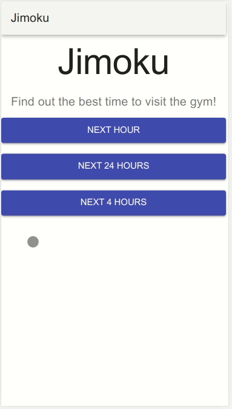

# Jimoku

Jimoku is a web app that estimates the future occupation of the student gym in St Andrews. 

The estimation is done by a Polynomial Linear regression model. 

The data, to train the model, was parsed from the [Sports Center page](https://sport.wp.st-andrews.ac.uk/) of University of St Andrews. 


The web components are implemented with:

- Python/Flask for server side
- JavaScript/React.js for client side

## Demo

User have three options to estimate future occupation for the next:
- 1 hour
- 4 hours
- 24 hours

<p align="center">
  
</p>


## Install 

### Requirements 
- Python
- pip
- Node.js
- npm 

<br>


Install Python dependencies:

```
pip install -r requirements.txt

```

Install Node.js dependencies:

```
cd front/

npm install
```

## Running

To run the application in development mode, first start the flask app:

```
cd api/

flask run
```

Then start the React app:

```
cd front/

npm start
```

Open [localhost:3000](http://localhost:3000/) in your browser to view the app

